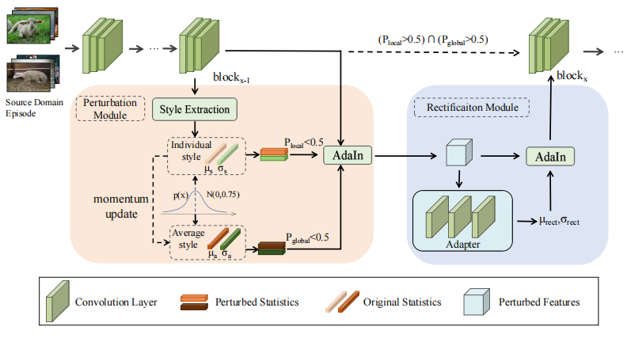

# Domain-Rectifying Adapter for Cross-domain Few-Shot Segmentation


The codebase contains the official code of our paper [Domain-Rectifying Adapter for Cross-Domain Few-Shot Segmentation](https://arxiv.org/abs/2404.10322), CVPR 2024.


## Introduction

In our research, we employ the plug-and-play Domain Adapter to investigate the Cross-Domain Few-Shot Segmentation (CDFSS) problem. 
By integrating the adapter into the initial stages of the baseline model, we aim to align images from various domains to a standardized source domain, thereby mitigating domain discrepancies across different domains.
<p align="middle">
    
</p>
The Cross-Domain Few-Shot Semantic Segmentation includes data from the Deepglobe [1], ISIC2018 [2-3], Chest X-ray [4-5], and FSS-1000 [6] datasets.

## Data preparation

### Download

You can follow [PATNet](https://github.com/slei109/PATNet) to prepare the source domain and target domain datasets.

#### Source domain:

* **PASCAL VOC2012**:

    Download PASCAL VOC2012 devkit (train/val data):
    ```bash
    wget http://host.robots.ox.ac.uk/pascal/VOC/voc2012/VOCtrainval_11-May-2012.tar
    ```
    Download PASCAL VOC2012 SDS extended mask annotations from [[Google Drive](https://drive.google.com/file/d/10zxG2VExoEZUeyQl_uXga2OWHjGeZaf2/view?usp=sharing)].

#### Target domains: 

* **Deepglobe**:

    Home: http://deepglobe.org/

    Direct: https://www.kaggle.com/datasets/balraj98/deepglobe-land-cover-classification-dataset
    
    Preprocessed Data: https://drive.google.com/file/d/10qsi1NRyFKFyoIq1gAKDab6xkbE0Vc74/view?usp=sharing

* **ISIC2018**:

    Home: http://challenge2018.isic-archive.com

    Direct (must login): https://challenge.isic-archive.com/data#2018
    
    Class Information: data/isic/class_id.csv
    
    Preprocess: After downloading the ISIC dataset, please utilize the "./data_util/ISIC_Split.py" script to preprocess the raw ISIC data.

* **Chest X-ray**:

    Home: https://www.ncbi.nlm.nih.gov/pmc/articles/PMC4256233/

    Direct: https://www.kaggle.com/datasets/nikhilpandey360/chest-xray-masks-and-labels

* **FSS-1000**:

    Home: https://github.com/HKUSTCV/FSS-1000

    Direct: https://drive.google.com/file/d/16TgqOeI_0P41Eh3jWQlxlRXG9KIqtMgI/view

#### models:

* **Pretrained model:** [ResNet-50](https://drive.google.com/file/d/11yONyypvBEYZEh9NIOJBGMdiLLAgsMgj/view?usp=sharing) 

* **Base model trained in original [SSP](https://github.com/fanq15/SSP):** Ori_SSP_trained_on_VOC.pth([Google drive](https://drive.google.com/file/d/1Cqqsqy1ojc-CbI7y2in--JFa2e1CCN61/view?usp=drive_link)||[Baidu Netdisk](https://pan.baidu.com/s/1kcSekjSAa1KYyK7gzrPDAw?pwd=b2nt))


Please place the Ori_SSP_trained_on_VOC.pth, trained in [SSP](https://github.com/fanq15/SSP), under the directory ./outdir/models/, and put the resnet50.pth under ./outdir/models/pretrained/.

### File Organization

```
    DR_Adapter                 # current (project) directory
       ├── codes               # various codes
       ├── ./outdir            # (dir)pretrained model and output model 
       │       ├── Ori_SSP_trained_on_VOC.pth
       │       ├── pretrained/
       │         └── resnet50.pth
       └── ./data
           ├── VOCdevkit/                # PASCAL VOC2012 devkit
           │    └── VOC2012/            
           │         ├── Annotations/
           │         ├── ImageSets/
           │         ├── ...
           │         └── SegmentationClassAug/
           ├── chest/           
           │    └── LungSegmentation      # lung benchmark
           │
           ├── fss
           │    └── FSS-1000/            # fss benchmark
           │        ├── abacus/   
           │        ├── ...
           │        └── zucchini/
           ├── ISIC
           │    └── ISIC/                # ISIC benchmark
           └── deepglobe
                └── Deepglobe/            # deepglobe benchmark
```

## Requirements

- Python 3.7
- PyTorch 1.5.1
- cuda 10.1
- tensorboard 1.14

Conda environment settings:
```bash
conda create -n patnet python=3.7
conda activate patnet

conda install pytorch=1.5.1 torchvision cudatoolkit=10.1 -c pytorch
conda install -c conda-forge tensorflow
pip install tensorboardX
```

## Run the code

### Training
> ```bash
> python train.py --train_datapath ./data/VOCdevkit
>                 --shot 1
>                 --benchmark pascal
>                 --bsz 8
>                 --logpath "your_experiment_name"
> ```

## Testing
> ```bash
> python test.py --test_datapath {./data/fss, ./data/chest, ./data/ISIC, ./data/deepglobe}
>                --benchmark {fss,lung,isic,deepglobe}
>                --nshot {1, 5} 
>                --checkpoint_path "./outdir/models/pascal/best_model.pth"
> ```

## Acknowledgement

This codebase is built based on [SSP's baseline code](https://github.com/fanq15/SSP) and we borrow [PATNet](https://github.com/slei109/PATNet)'s evaluation protocol for the different dataset.
We thank [SSP](https://github.com/fanq15/SSP) and [PATNet](https://github.com/slei109/PATNet) and other FSS works for their great contributions.


## Citation

```bibtex
@article{su2024domain,
  title={Domain-Rectifying Adapter for Cross-Domain Few-Shot Segmentation},
  author={Su, Jiapeng and Fan, Qi and Lu, Guangming and Chen, Fanglin and Pei, Wenjie},
  journal={arXiv preprint arXiv:2404.10322},
  year={2024}
}
```


## References

[1] Demir, I., Koperski, K., Lindenbaum, D., Pang, G., Huang, J., Basu, S., Hughes,
F., Tuia, D., Raskar, R.: Deepglobe 2018: A challenge to parse the earth through
satellite images. In: The IEEE Conference on Computer Vision and Pattern Recog-
nition (CVPR) Workshops (June 2018)Li, X., Wei, T., Chen, Y.P., Tai, Y.W., Tang, C.K.: Fss-1000: A 1000-class dataset
for few-shot segmentation. In: Proceedings of the IEEE/CVF Conference on Com-
puter Vision and Pattern Recognition. pp. 2869–2878 (2020)

[2] Codella, N., Rotemberg, V., Tschandl, P., Celebi, M.E., Dusza, S., Gutman, D.,
Helba, B., Kalloo, A., Liopyris, K., Marchetti, M., et al.: Skin lesion analysis toward
melanoma detection 2018: A challenge hosted by the international skin imaging
collaboration (isic). arXiv preprint arXiv:1902.03368 (2019)

[3] Tschandl, P., Rosendahl, C., Kittler, H.: The ham10000 dataset, a large collection
of multi-source dermatoscopic images of common pigmented skin lesions. Scientific
data 5, 180161 (2018)

[4] Candemir, S., Jaeger, S., Palaniappan, K., Musco, J.P., Singh, R.K., Xue, Z.,
Karargyris, A., Antani, S., Thoma, G., McDonald, C.J.: Lung segmentation in
chest radiographs using anatomical atlases with nonrigid registration. IEEE trans-
actions on medical imaging 33(2), 577–590 (2013)

[5] Jaeger, S., Karargyris, A., Candemir, S., Folio, L., Siegelman, J., Callaghan, F.,
Xue, Z., Palaniappan, K., Singh, R.K., Antani, S., et al.: Automatic tuberculosis
screening using chest radiographs. IEEE transactions on medical imaging 33(2),
233–245 (2013)

[6] Li, X., Wei, T., Chen, Y.P., Tai, Y.W., Tang, C.K.: Fss-1000: A 1000-class dataset
for few-shot segmentation. In: Proceedings of the IEEE/CVF Conference on Com-
puter Vision and Pattern Recognition. pp. 2869–2878 (2020)